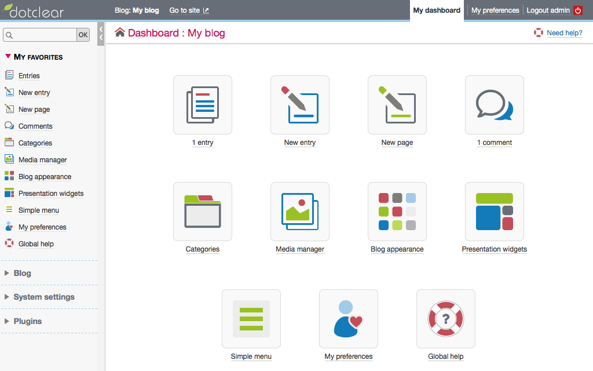

<!--
N.B.: This README was automatically generated by https://github.com/YunoHost/apps/tree/master/tools/README-generator
It shall NOT be edited by hand.
-->

# DotClear 2 for YunoHost

[](https://dash.yunohost.org/appci/app/dotclear2)  

[](https://install-app.yunohost.org/?app=dotclear2)

*[Lire ce readme en français.](./README_fr.md)*

> *This package allows you to install DotClear 2 quickly and simply on a YunoHost server.
If you don't have YunoHost, please consult [the guide](https://yunohost.org/#/install) to learn how to install it.*

## Overview

Dotclear is an open-source web publishing software.

The project's purpose is to provide a user-friendly tool allowing anyone to publish on the web, regardless of their technical skills.

Dotclear is a free software primarily designed for its users and regularly improved by their contributions.


**Shipped version:** 2.24.1~ynh1

**Demo:** https://www.softaculous.com/demos/Dotclear

## Screenshots



## Documentation and resources

* Official app website: <https://dotclear.org>
* Official admin documentation: <https://dotclear.org/documentation/2.0>
* Upstream app code repository: <https://git.dotclear.org/dev/dotclear>
* YunoHost Store: <https://apps.yunohost.org/app/dotclear2>
* Report a bug: <https://github.com/YunoHost-Apps/dotclear2_ynh/issues>

## Developer info

Please send your pull request to the [testing branch](https://github.com/YunoHost-Apps/dotclear2_ynh/tree/testing).

To try the testing branch, please proceed like that.

``` bash
sudo yunohost app install https://github.com/YunoHost-Apps/dotclear2_ynh/tree/testing --debug
or
sudo yunohost app upgrade dotclear2 -u https://github.com/YunoHost-Apps/dotclear2_ynh/tree/testing --debug
```

**More info regarding app packaging:** <https://yunohost.org/packaging_apps>
